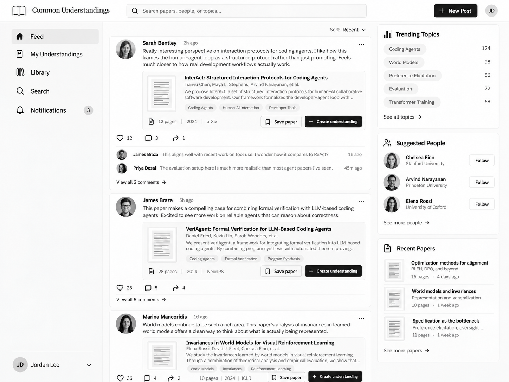
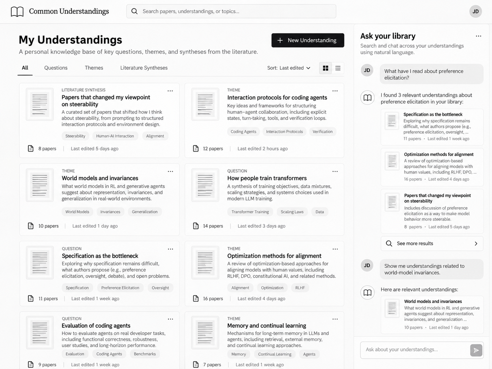
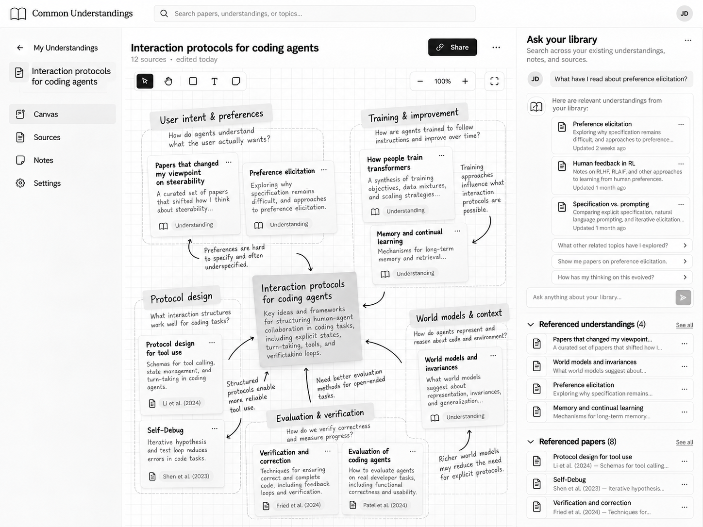

# Problem Framing

### Domain

Researchers read papers for many purposes. They may want to learn about an area, answer a specific question, find methods for their own project, discover whether something's already been done, or conduct a literature review. Or, they may simply find a paper interesting.

However, reading a paper is often only one step to fulfilling these purposes. The entire workflow for finding, reading, understanding, and using papers can include any of the following activities:

- searching for and exploring many papers

- saving papers for later

- taking notes/highlights

- following citations and related work

- organizing papers into categories

- returning to previously read papers

- synthesizing findings across papers

- sharing papers with collaborators for discussion.


These activities accumulate over long periods of time. A researcher may encounter hundreds or thousands of papers as their questions and projects evolve. Ideally, they want to preserve the understanding they gain from each paper in a way that is easily accessible for future use.


### Bad Situations
1. **Theme:** Difficulty cultivating long term understanding.

    1. **User reads a paper without truly understanding it, and must eventually re-read it:** Let's say a user reads a paper with a certain goal, such as answering a research question. However, as they are reading, they don't fully answer their question. Perhaps this is because the paper is poorly-written, uses technical terms they don't understand, or has other barriers to understanding. The user spent time reading, didn't get the answer they needed, and eventually has to return to the paper and read it more in-depth.

    2. **User understands paper but doesn't store their understanding, and must re-read paper later:** Another variant of the above situation occurs when a user does understand the paper (e.g. answer their research question) but doesn't store that understanding in some way. Therefore, when it's time to do their literature review, they must re-read the paper and try to remember their prior conclusion.

    3. **User understands individual papers but cannot easily synthesize them later:** When doing a literature review or answering a new research question, the user must determine which previously read papers matter, compare them, and extract higher-level themes. Their prior notes are organized paper-by-paper rather than around the current project/question, so the user must reopen papers and reconstruct comparisons and relationships they've already noticed before.

2. **Theme:** It's hard for users to predict how they will use papers after reading them. They may not know what questions they'll ask in the future, what kind of literature reviews they'll do, or what kind of methods they'll be looking for. This theme is encountered when users try to solve the first theme of bad situations (above). The following bad situations occur:

    1. **Paper organization structure doesn't fit current use:** A user creates a structure in which to organize their papers, for example, using collections on Zotero. However, as they try to save more and more papers, for different use cases (such as a new project) these collections become too granular, too broad, or simply irrelevant.

    2. **Maintaining paper organization structure becomes overwhelming and users give up:** As the user saves more and more papers, maintaining their structure (e.g. Zotero collections, relationships in RoamResearch or Obsidian, folders in Google Drive) becomes more and more work. This amount of work becomes so overwhelming that users abandon their structure entirely or even stop reading papers.

    3. **Users don't know what to take notes on while reading:** At the time of reading, users may not know what's useful to write down

2. **Theme:** Decentralization of tools and resources.

    1. **Burdensome context-switching and navigation cost:** In order to read, synthesize, take notes on, and share papers, users must switch between their paper reader (e.g. browser or Zotero), perhaps a notes app (e.g. Notero, Notion, Zotero), and conversation tool (e.g. Slack, email) multiple times. This switching becomes even more annoying as the user explores multiple papers and has to keep track of many open tabs. It may prevent users from actually taking notes.

    2. **Resources spread across tools:** A user may have their notes on a paper in one tool (e.g. Notion) and their conversation with their colleague about it in another (e.g. Slack). However, both have useful insights that the user might want access to later.

    3. **Hard to find valuable papers and share insights:** Users struggle to find papers their peers have read or find valuable. They may have to ask peers for access to their **entire** paper organization system. A student may spend a lot of time reading a paper just to find out their collaborator sees a huge hole in the paper's method much later.


### Corroboration

Interviews from my lab-mates and fellow PhD students corroborate these bad situations:

- One labmate expressed the desire to create a structured way of saving, reading, and taking notes on papers, but said that he has historically struggled to do so. He told me that he tried saving papers under themes in Google Sheets, but it became so much maintenance that he stopped reading papers altogether. He's also tried saving notes in Google Docs, and highlighting and saving papers in Zotero. However, all of these methods impose too much friction on the paper-reading process. He said he usually resorts to uploading a paper to Claude or Codex as he's reading it, asking the agent questions, and not saving notes or the conversation.

- Another lab-mate told me the main difficulty she faces is synthesizing content across papers. She lacks an easy way to compare/contrast papers with one another and with her ideas.

- Another fellow PhD student -- also looking for this structured way of saving papers, notes, and thoughts -- created an entire categorical system in Notion, alongside a Zotero plugin, for saving papers and taking notes. This categorization included whether he's read the paper, any notes he has, relevant keywords, relevance to projects, and more. However, it was too much work to keep up, and he stopped using it. I've had this exact same experience.

- Personally, I've attempted many workflows to keep track of my reading and easily synthesize themes across papers in literature reviews. I've abandoned all workflows I've tried so far. I also routinely experience the navigation and fragmentation costs described in the bad situations above. I'll go down rabbit holes exploring papers and their citations, opening up to 30 tabs in my browser. I'll lose track of each paper, write notes in random locations, and end up having to reopen and reread each paper multiple times to fully extract the common themes I need. Navigating through many different papers and note-taking applications becomes exhausting, and the entire process is inefficient.


The main takeaway from these experiences is that users seek out a way to save papers, take notes, and return to papers, but every system they've created to do so has had too much friction to be useful in the long term.


Additionally, my lab has explicitly expressed the need for an easy way to share papers we've read or find interesting. This is especially relevant in our field, machine learning, where there's a huge volume of papers to explore and many of them can be low-quality. We want an easy way to weed out and share the high-quality papers. We also share papers through many disparate channels -- Slack, email, and text -- where we can easily lose track of them.

## Workarounds and Comparables

**Workarounds**


To mitigate the decentralization of tools and resources for paper management, many users rely on plugins. A common workflow is to use Zotero (and the Zotero browser plugin) to save, annotate, and organize papers into Collections. Many users combine Zotero with a note-taking platform like Obsidian, RoamResearch, or Notion, linking papers to their notes with plugins like Notero. However, these plugins can lead to further bad situations -- most prominently the platforms not syncing correctly.


To mitigate the struggle of cultivating long term understanding, users create their own structure around their paper management. For example, in RoamResearch, users perform "sense-making" by linking together related papers and thoughts. To help synthesize papers, users may store papers hierarchically in their project directories, according to themes, and embed these links in their notes. However, ultimately this leads to the first bad situation: Structure becoming too cumbersome to maintain as complexity grows. I've spoken with fellow PhD students and lab-mates who have given up on making connections in RoamResearch and performing diligent note-taking in Notion, because it simply becomes too much work.


Another work-around to cultivating long term understanding is abandoning structured note-taking and using AI agents to answer questions on-the-fly about papers. While this is very useful, it's almost too extreme of a method. Although it takes away the burden of structured note-taking, it also takes away the opportunity for users to perform deep-thinking and synthesis on their own.


Another work-around is simply using printed papers and margin notes to understand papers while reading. Although these methods are low-friction, they miss the opportunity to search, share, and synthesize the understanding users gained later on.


Finally, researchers often share papers and discuss them through Slack, email, text messages, or reading groups, where valuable interpretations can become spread across disparate platforms and difficult to recover later. This also promotes a feeling of decentralization for users: It can be overwhelming for them to feel like the things they've learned are so spread apart.


**Comparables**


Platforms like ResearchRabbit, Connected Papers, and Litmaps help users explore related literature. However, these tools generally focus on helping users **explore** rather than preserve and organize what individuals and labs have learned. Outside of research, Goodreads lets readers track books, organize shelves, see what friends are reading, and share reviews. Platforms like Spotify are also similar to this idea: Users can save and organize the music they like into playlists, and share playlists.


### Stakeholders

- **Individual researchers** who are

    - conducting literature reviews,

    - exploring/entering a field,

    - developing a method and looking for insight on **how**,

    - or answering a project-related question.

- **Research labs or organizations** in which members want to share and discuss literature.


# Application Pitch

**Name:** Common Understandings


**Motivation:**

Reading, understanding, and sharing papers are essential activities of researchers. We read papers to learn about a field, stay up-to-date on recent advancements, develop a new method, contextualize a project, and think of new ideas. Synthesizing literature helps us build our understanding of our field, and perform our work.


In an ideal world, researchers build up their own research knowledge base as they read more papers. Many refer to this type of knowledge base as a "second brain." Researchers cultivate their understanding by looking through their knowledge base, asking questions, synthesizing themes, and building on their prior learnings. They add the new understanding they gain to further grow their knowledge base.


However, this ideal world hasn't materialized. Managing papers and the knowledge we gain from them is a complex task. It's hard to semantically organize and summarize papers in a way that will be useful to your future self, who will be trying to do a literature review for a new project or looking for a specific method. Research papers are multi-faceted, so any given paper may fit into many semantic categories and have many features worth noting.


As a result, users' attempts to build their knowledge bases tend towards one of two extremes. In an attempt to make it easy for their future selves to extract knowledge, they impose unrealistic structure on their knowledge base. For example, they make connections in RoamResearch or build literature-organizers connecting Zotero and Notion. Most often, this structure doesn't stand the test of time. Researchers encounter situations where the structure they've created doesn't serve their current use case, and the structure becomes too burdensome to maintain as complexity grows. On the other extreme, users abandon structure entirely, fragmenting their knowledge base across paper-saving tools (e.g. Zotero), note-taking tools (e.g. Obsidian, Apple Notes, Notion, hand-written notes), social platforms (e.g. Slack, email, text), and LLM conversations. While this strategy prevents the cognitive overwhelm of unrealistic structure, it loses out on the potential for new levels of understanding from a knowledge base.


Another part of the ideal world is easily **sharing** knowledge bases. Researchers within the same lab or field could grow their own knowledge bases by having access to the papers read and insights gained from their colleagues. However, the ease of sharing is inhibited by navigation costs: Users are forced to share papers and manage their own knowledge bases in different platforms. The friction of navigating from one platform to another makes sharing difficult.


**Key Features:**

I propose **Common Understandings**, a platform where researchers can build and share their understanding of scientific literature.


The first key insight behind this platform is that the core goal of researchers in engaging with literature is to **build understanding over time.** Researchers do so in three steps: capturing, retrieving, and synthesizing understanding. With this frame of thinking, we can see that structured systems for managing papers were just a poor means to this end. When researchers read a paper, they want to **capture** the way they understood it, such that they can understand it again later.  Structures like hierarchical directories or links help them easily **retrieve** these prior understandings, such as a relevant paper and their notes on it. Additionally, the act of creating these structures helps them **synthesize** their understandings. But these means of building understanding impose too much friction on researchers.


So, the question becomes: How can we help researchers build understanding from scientific literature with as little friction as possible? Our second key insight is that AI advancements make this possible. Researchers can **capture** their understanding with lightweight notes attached to papers, from which we can extract metadata and produce a semantic embedding. When researchers later need something they have read, semantic search can **retrieve** relevant papers and prior understandings without requiring them to have been filed correctly in advance. When researchers want to **synthesize** many concepts (e.g. write their literature review), we can retrieve relevant prior understandings with semantic search and help the researchers build a new understanding out of them. Finally, *_Common Understandings_* makes these understandings shareable, allowing researchers to build not only on their own prior learnings, but also on what their collaborators have learned.


In summary, we have the following key features:

- **Capturing understanding:** Researchers can save a paper to their library, along with an optional note containing their understanding of it. This may explain a specific method, answer a question, or summarize the paper. This step takes very little effort from the researcher. The goal is just to preserve their own interpretation while avoiding the burden of maintaining folders, tags, or connections that may not be useful later.

- **Retrieve understanding.** When a researcher returns to a topic, method, or question, they can search semantically across the papers and understandings they have saved. Instead of relying on folders, tags, or manually maintained links, the software surfaces the prior work most relevant to the researcher’s query.

- **Building understanding:** When a researcher has a new question or project, they can ask *_Common Understandings_* to bring together relevant papers and prior understandings from their library. The interface makes it easy for them to pull from those prior understandings to build a new one, which they can add to their library. This makes it easy for researchers to build on what they've already learned, without having to re-discover or re-read papers.

- **Sharing understanding:** Researchers can post an understanding -- which may come from one paper or a synthesis of multiple papers -- to a shared forum for discussion with other members of their organization. Additionally, when researchers open a paper, they can see the understandings and discussions that other researchers have attached to it. This lets researchers benefit from one another's views and gradually build shared understanding with minimal effort, rather than keeping understandings isolated in private notes or fragmented across platforms.


# Concept Design


```

concept Saving [User, Item]

purpose
 let users preserve items for later use

principle
 a user saves an item they may want later; the item remains available to them until they choose to remove it

state
 a set of Users with
   a set of saved Items

actions
 save (user: User, item: Item)
   then add the item to the user's saved items

 unsave (user: User, item: Item)
   when the item is saved by the user
   then remove the item from the user's saved items


concept Composing [Author, Item]

purpose
 let authors build a new artifact by combining and revising existing material

principle
 an author creates a composition, adds items that contribute to it, and revises its content as the composition develops

state
 a set of Compositions with
   an author Author
   content String
   a set of included Items

actions
create (author: Author, content: String, items: set of Item): (composition: Composition)
  then create a new composition with the given author, content, and included items, and return it


 addItem (composition: Composition, item: Item)
   when the composition exists
   then add the item to the composition's included items


 removeItem (composition: Composition, item: Item)
   when the composition exists and the item is included
   then remove the item from the composition's included items


 edit (composition: Composition, content: String)
   when the composition exists
   then replace the composition's content with the given content


 remove (composition: Composition)
   when the composition exists
   then remove the composition


concept SemanticSearching [Item]

purpose
 let users find relevant items based on semantic similarity rather than exact wording or an organization system


principle
 an item is added with content representing its meaning; an embedding of that content is stored with the item. When a user searches with a query, the query is embedded in the same way and items with the most similar embeddings are returned first

state
 a set of Items with
   an embedding Vector

actions
 add (item: Item, content: String)
   then compute an embedding of the content and associate the resulting embedding with the item, replacing any previous embedding for that item

 search (query: String): (results: sequence of Item)
   then compute an embedding of the query and return items ordered by
   similarity between their stored embeddings and the query embedding

 remove (item: Item)
   when the item has an embedding
   then remove the item and its embedding


concept Posting [Author, Item, Forum]

purpose
 let authors make items available to an audience

principle
 an author posts an item to a forum; the post makes that item available through the forum until the post is removed

state
 a set of Posts with
   an author Author
   an Item
   a Forum


actions
 post (author: Author, item: Item, forum: Forum): (post: Post)
   then create a new post with the given author, item, and forum, and return it

 remove (post: Post)
   when the post exists
   then remove the post


concept Commenting [Author, Target]

purpose
 let people respond to and discuss a shared target

principle
 an author comments on a target; other authors can respond either to the target or to an existing comment, allowing a discussion to develop around it

state
 a set of Comments with
   an author Author
   a Target
   content String
   an optional parent Comment

actions
 comment (author: Author, target: Target, content: String): (comment: Comment)
   then create a new comment with the given author, target, and content,
   and return it

 reply (author: Author, parent: Comment, content: String): (comment: Comment)
   when the parent comment exists
   then create a new comment with the given author and content whose parent
   is the given comment, and return it

 edit (comment: Comment, content: String)
   when the comment exists
   then replace the comment's content with the given content

 remove (comment: Comment)
   when the comment exists
   then remove the comment

```


**Note: How they are used**

- The Saving concept allows users to save existing items to their library. The generic type Item could be instantiated as a Paper or an Understanding. Users will use this concept to save papers to their library quickly, without adding any understanding yet. The machine will use this concept when an understanding is composed to save it to the user's library.

- The Composing concept is the mechanism through which users create understandings. Each understanding contains textual content and a set of associated Items, which could be instantiated as Papers or existing Understandings. This allows understandings to be flexible: they can be based on one or more papers, prior understandings, or a combination of both.

- The SemanticSearching concept allows users to **retrieve** existing understandings based on a query. It works by embedding understandings and queries, and then measuring similarity between them.

- The Posting and Commenting concepts are quite generic. The Forum would be instantiated as a lab group, the Item in a post would be instantiated as an Understanding, and the Target of a comment would be a Post. Replies to comments are represented separately through Commenting's parent Comment relation. This allows users to post and discuss understandings.


### Key Reactions


```
# Saving a paper stores it and makes the paper searchable
when Requesting.savePaper (user, paper, paperContent)
then
  Saving.save (user, paper)
  SemanticSearching.add (paper, paperContent)

# Creating an understanding creates a composition from its initial content and sources
when Requesting.createUnderstanding (author, content, items): (composition)
then Composing.create (author, content, items): (composition)

# A newly created understanding becomes semantically searchable
when Composing.create (author, content, items): (composition)
then SemanticSearching.add (composition, content)

# If a paper used to create an understanding has not been saved before, save the paper and make the paper itself searchable
when Requesting.createUnderstanding (author, content, items)
where
  paper is in items
  and paper is not saved by author
  and paperContent is the content of paper
then
  Saving.save (author, paper)
  SemanticSearching.add (paper, paperContent)

# Editing an understanding updates its semantic representation
when Composing.edit (composition, content)
then SemanticSearching.add (composition, content)

# Deleting an understanding removes it from semantic search
when Composing.remove (composition)
then SemanticSearching.remove (composition)

# Deleting an understanding removes any posts that share it
when Composing.remove (composition)
where Posting: post has item composition
then Posting.remove (post)

# Sharing an understanding creates a post
when Requesting.postUnderstanding (author, understanding, forum)
then Posting.post (author, understanding, forum)

# Commenting on a post creates a comment
when Requesting.comment (author, post, content)
then Commenting.comment (author, post, content)

# Removing a post removes comments attached to that post
when Posting.remove (post)
where Commenting: comment has target post
then Commenting.remove (comment)

```


# UI Sketches

This first sketch shows the user's feed. They see other users' posted understandings. From a post, they can choose to save the paper to their library or create their own understanding.




The following sketch shows each user's profile. It contains all of their understandings and allows them to semantically search through them.




The final sketch shows one understanding. It is shown in the canvas format, where it's easy for the user to organize their thoughts and show sub-themes. However, users will also be able to write the full understanding in text.




# User Journey


A researcher comes across an interesting paper in their **Common Understandings feed**, posted by a member of their lab. The paper introduces a new zeroth-order optimization method for machine learning models. It is not directly relevant to the researcher’s current work, but seems potentially useful, so they save the paper to their library and move on. They do not need to read it in-depth, write a detailed note, or decide where it belongs in a folder hierarchy before they know how they will use it.


Months later, the researcher decides to do a deep dive on how machine learning models are optimized. They want to understand state-of-the-art methods. From their **My Understandings** page, they create a new understanding titled *_How to Optimize ML Models_* and query their library for work related to optimization. The zeroth-order paper resurfaces alongside their prior understandings -- and understandings of their lab-mates -- on optimization methods.


The researcher now reads the zeroth-order paper and writes a brief understanding of it. They also review the related understandings. In the **Understanding workspace**, they keep these references visible in the sidebar while arranging methods and ideas on the canvas into themes. They write notes about how the approaches relate. By the end, they have built a synthesis of modern optimization methods that reflects both what they just learned and what they had understood previously. Furthermore, that synthesis is preserved as an understanding they can return to and build on later.


# Bibliography


Bergman, O., & Whittaker, S. (2016). *_The Science of Managing Our Digital Stuff_*. MIT Press. [https://doi.org/10.7551/mitpress/9780262035170.001.0001](https://doi.org/10.7551/mitpress/9780262035170.001.0001?utm_source=chatgpt.com) [MIT Press](https://mitpress.mit.edu/9780262035170/the-science-of-managing-our-digital-stuff/?utm_source=chatgpt.com)


Jones, E., Bruce, H., Klasnja, P., & Jones, W. (2008). I give up! Five factors that contribute to the abandonment of information management strategies. *_Proceedings of the American Society for Information Science and Technology, 45_*(1), 1–6. [https://doi.org/10.1002/meet.2008.14504503115](https://doi.org/10.1002/meet.2008.14504503115?utm_source=chatgpt.com) [ASIST](https://asistdl.onlinelibrary.wiley.com/doi/abs/10.1002/meet.2008.14504503115?utm_source=chatgpt.com)


Uren, V., Buckingham Shum, S., Bachler, M., & Li, G. (2006). Sensemaking tools for understanding research literatures: Design, implementation and user evaluation. *_International Journal of Human-Computer Studies, 64_*(5), 420–445. [https://doi.org/10.1016/j.ijhcs.2005.09.004](https://doi.org/10.1016/j.ijhcs.2005.09.004) [ScienceDirect](https://www.sciencedirect.com/science/article/pii/S1071581905001709?utm_source=chatgpt.com)


Vicente, K. J., & Brewer, W. F. (1993). Reconstructive remembering of the scientific literature. *_Cognition, 46_*(2), 101–128. [https://doi.org/10.1016/0010-0277(93)90015-N](https://doi.org/10.1016/0010-0277\(93\)90015-N)